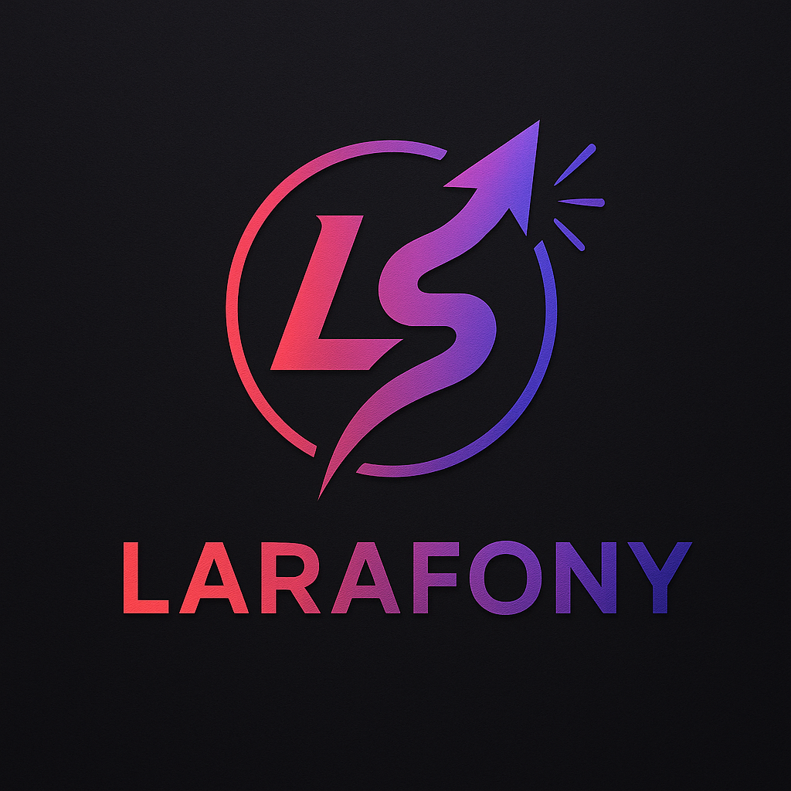

# Larafony



**Larafony** is a modern, lightweight PHP framework that combines the **developer experience of Laravel**, the **robustness of Symfony**, and the **power of PHP 8.5** — all without compromise.  
It’s designed for **production-grade applications**, not tutorials or demos.

---

## ✨ Key Features

- **⚙️ Built on PSR Standards**  
  Full support for **PSR-7 (HTTP)**, **PSR-11 (Container)**, **PSR-15 (Middleware)**, and **PSR-3 (Logger)**.  
  Interoperability at its core — use any compliant library or component you prefer.

- **🧩 Attribute-Based Design**  
  Fully powered by **PHP Attributes**, bringing clean syntax and native reflection instead of verbose annotations or configuration files.

- **🔓 Not Locked into One Ecosystem**  
  You’re free to choose your tools. Larafony works seamlessly with:
    - **Inertia.js**
    - **Vue.js**
    - **Blade**
    - **Twig**

- **🪶 Minimal Dependencies**  
  A **minimal `composer.json`** — PSR packages only. No unnecessary framework bloat.

- **🧱 Custom Middleware Stack**  
  A powerful yet simple **middleware pipeline**, inspired by PSR-15 and fine-tuned for performance.

- **📊 Built-in Backend Analytics**  
  Privacy-friendly, **cookie-free analytics**, with no dependence on Google or external trackers.

---

## 🚀 Philosophy

> **Larafony** exists for developers who love the elegance of Laravel, the discipline of Symfony, and the freedom of pure PHP.  
> It’s opinionated where it matters — and unopinionated everywhere else.

- **Production-ready from day one**
- **Framework-agnostic mindset**
- **Performance-first architecture**
- **Readable, modern PHP code**

---

## 🧰 Requirements

- PHP ≥ 8.5
- Composer 2.9+
- PSR-compliant HTTP and container packages (installed automatically)
- OpenSSL enabled
- extensions enabled: `curl`, `mbstring`,`pdo`, `uri`, `xml`

⚠️ If you see deprecation warnings during `composer create-project`,
run:

```bash
composer self-update
```
❗Running Larafony on older PHP / Composer versions is **not supported**
and issues caused by outdated environments will be closed without investigation.

### Docker Alternative

For a containerized development environment:
- Docker ≥ 20.10
- Docker Compose ≥ 2.0

See [DOCKER.md](DOCKER.md) for complete Docker setup and usage instructions.

## 🧭 Roadmap

> Each chapter is developed in a separate branch and includes unit tests using PHPUnit.

### 🧩 Core Foundation
- [x] Base framework configuration — [Chapter 1](docs/Larafony/chapter1.md)
- [x] Simple error handling — [Chapter 2](docs/Larafony/chapter_2.md)
- [x] Simple timer using PSR-20 (Simple Carbon replacement) — [Chapter 3](docs/Larafony/chapter_3.md)
- [x] HTTP requests with PSR-7/PSR-17 (Simple Web Kernel) — [Chapter 4](docs/Larafony/chapter_4.md)
- [x] Dependency Injection using PSR-11 — [Chapter 5](docs/Larafony/chapter_5.md)

### 🌐 HTTP Layer
- [x] Routing using PSR-15 — [Chapter 6](docs/Larafony/chapter_6.md)
- [x] HTTP client using PSR-18 (Simple Guzzle replacement) — [Chapter 7](docs/Larafony/chapter_7.md)
- [x] Environment variables and configuration — [Chapter 8](docs/Larafony/chapter_8.md)

### ⚙️ Console & Databasechap
- [x] Console Kernel — [Chapter 9](docs/Larafony/chapter_9.md)
- [x] MySQL Schema Builder — [Chapter 10](docs/Larafony/chapter_10.md)
- [x] MySQL Query Builder — [Chapter 11](docs/Larafony/chapter_11.md)
- [x] MySQL Migrations — [Chapter 12](docs/Larafony/chapter_12.md)
- [x] ORM (ActiveRecord with Property Observers) — [Chapter 13](docs/Larafony/chapter_13.md)

### 🧱 Application Layer
- [x] Logging System (PSR-3) — [Chapter 14](docs/Larafony/chapter_14.md)
- [x] Middleware System (PSR-15) + Advanced routing — [Chapter 15](docs/Larafony/chapter_15.md)
- [x] DTO-based Form Validation — [Chapter 16](docs/Larafony/chapter_16.md)

### 🎨 View Layer (simple)
- [x] Custom Blade Parser — [Chapter 17](docs/Larafony/chapter_17.md)

### 🌐 Migrating to packagist

- [x] Demo application as a separate project — [Chapter 18](docs/Larafony/chapter_18.md)

### 🎨 View Layer (SPA)
- [x] Inertia.js Middleware (Vue.js) — [Chapter 19](docs/Larafony/chapter_19.md)

### 💥 Error Handling
- [x] Advanced Web Error Handling — [Chapter 20](docs/Larafony/chapter_20.md)
- [x] Advanced Console Error Handling — [Chapter 21](docs/Larafony/chapter_21.md)

### 🔐 Security & Communication
- [x] Encrypted Cookies and Sessions — [Chapter 22](docs/Larafony/chapter_22.md)
- [x] Sending Emails — [Chapter 23](docs/Larafony/chapter_23.md)
- [x] Authorization System — [Chapter 24](docs/Larafony/chapter_24.md)
- [x] Cache Optimization (PSR-6) — [Chapter 25](docs/Larafony/chapter_25.md)
- [X] Event System (PSR-14) — [Chapter 26](docs/Larafony/chapter_26.md)
- [X] Debugbar +  Model Eager Loading— [Chapter 27](docs/Larafony/chapter_27.md)
- [x] Jobs and Queues — [Chapter 28](docs/Larafony/chapter_28.md)
- [ ] Simple WebSockets (almost from scratch) — [Chapter 29](docs/Larafony/chapter_29.md)
- [ ] Model Context Protocol — A new way of communication — Chapter 30

### 🧭 Meta
- [ ] Why Larafony — Comparing with Laravel, Symfony, CodeIgniter — Chapter 31

### 🧩 The Philosophy of the Final Chapters

**This will be updated while following packages reach FULL php8.5 support.**

Larafony’s journey doesn’t end with writing code — it ends with understanding.

The last chapters are not about adding features, but about **liberating the developer**.  
They show that every component — clock, container, logger, cache, or view — is *optional*, replaceable, and interchangeable.

Each replacement (Carbon, Monolog, Laravel Container, Twig, etc.) isn’t a “plugin”, but a **lesson**:
> how professional PHP code achieves the same result through different abstractions.

By the time you reach the end, you won’t just *use* a framework —  
you’ll **understand the architecture behind every framework**.

> "The best framework is the one you can replace piece by piece — because you understand it completely."

---

🧠 **Larafony is not just a framework.**  
It’s an open architecture, a teaching tool, and a manifesto of modern PHP.

Every line of code exists to remind you that:
- elegance is a function of simplicity,
- performance is a side effect of clarity, and
- real mastery means knowing when to write less.

Welcome to the end of the framework —  
and the beginning of **your own**.

### ⚙️ Extending with mature Libraries
- [ ] Larafony bridges - Chapter 32
  - [ ] View Bridges (Twig & Smarty)
  - [ ] Use Carbon instead of ClockFactory
  - [ ] Use Monolog
  - [ ] Use Symfony Mailer
  - [ ] Use Guzzle Http

## 🚀 Quick Start

### Using Docker (Recommended)

```bash
# Quick start - all in one script
./docker-test.sh              # Run tests without coverage
./docker-test.sh --coverage   # Run tests with HTML coverage report

# Or step by step
./docker.sh build             # Build Docker images
./docker.sh up                # Start MySQL service
./docker.sh test              # Run tests
./docker.sh quality           # Run all quality checks
```

**Coverage reports:**
- HTML report: Open `coverage/index.html` in your browser
- Text output: Use `./docker-test.sh --text`

See [DOCKER.md](DOCKER.md) for complete Docker documentation and all available commands.

### Using Local PHP

```bash
# Install dependencies
composer install

# Run tests
composer test

# Run quality checks
composer quality
```

## 🚀 Learn How It's Built—From Scratch

Interested in **how Larafony is built step by step?**

Check out my full PHP 8.5 course, where I explain everything from architecture to implementation — no magic, just clean code.

👉 Get it now at [masterphp.eu](https://masterphp.eu)

## Additional Resources

- [PSR Standards](https://www.php-fig.org/psr/)
- [PHPUnit Documentation](https://phpunit.de/)
- [PHPStan Documentation](https://phpstan.org/)
- [Composer Documentation](https://getcomposer.org/doc/)

License

The Larafony framework is open-sourced software licensed under the [MIT license](https://opensource.org/license/MIT).
